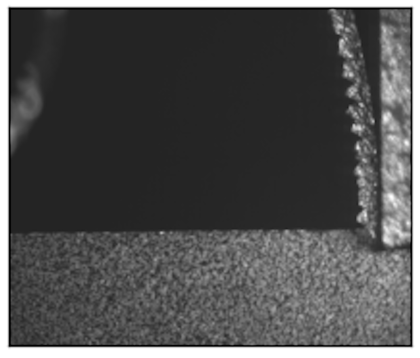
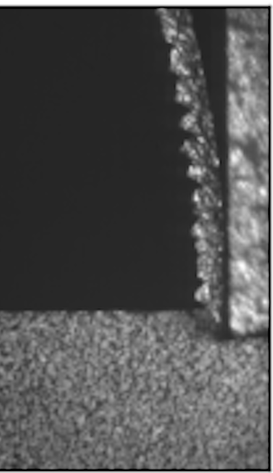
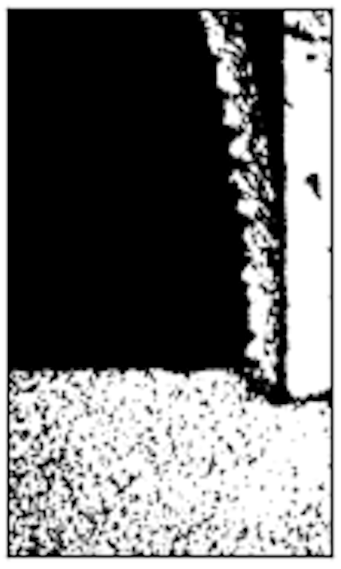
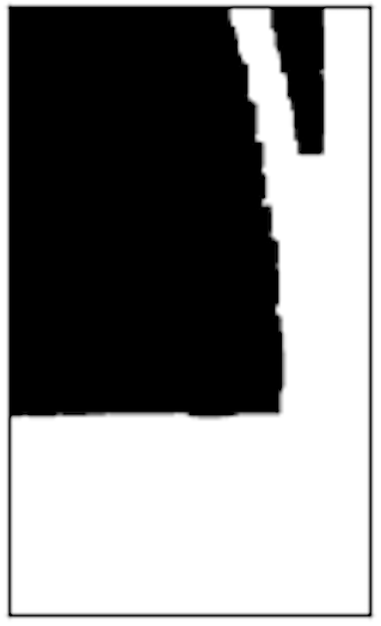
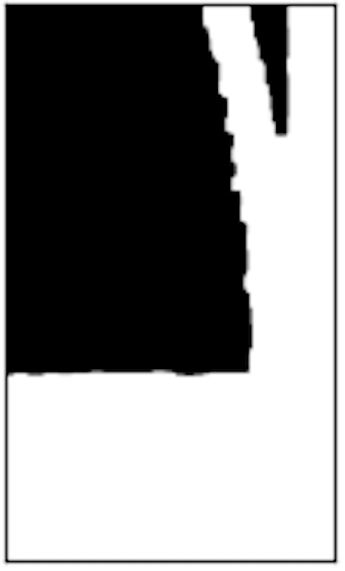
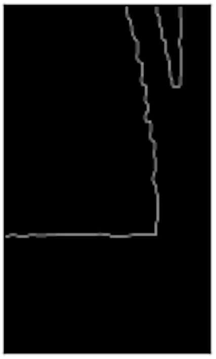
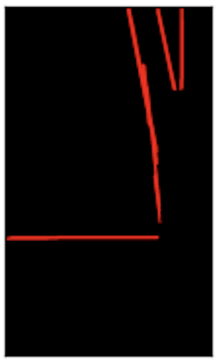
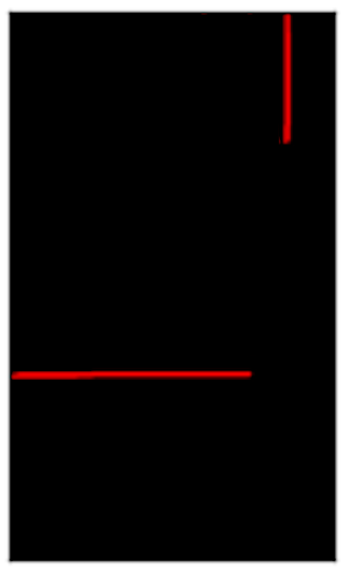
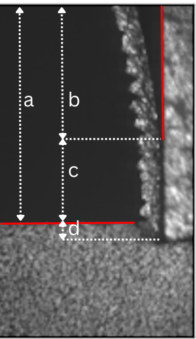
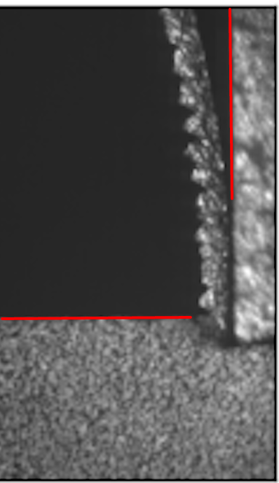

# Tool-Chip Contact Length (TCCL) — Documentation

## In plain English

When a lathe or milling tool cuts metal, the chip it peels off stays in contact with the tool's face for a short distance before curling away — that distance is the **tool-chip contact length**. A high-speed camera photographs the cutting zone, and this program measures that distance automatically, in pixels, from each photo.

It does this the way you might do it by hand with tracing paper: turn the photo black-and-white so the tool and chip stand out from the background, clean up the shape so its edge is one smooth line instead of a noisy, jagged one, find the two straight edges that matter (the flat edge of the workpiece/chip, and the edge of the tool), and measure the gap between them. The rest of this document walks through exactly how each of those "tracing paper" steps is implemented in code, with a picture of what the image looks like at every stage.

## Overview

This application measures the **Tool-Chip Contact Length** in metal-cutting images taken by a high-speed camera. It uses classic computer vision (OpenCV) to isolate the cutting tool and the chip in each image, detect the two relevant straight edges (the tool's contact edge and the chip's trailing edge), and compute the pixel distance between them.

The program is a batch pipeline: it loops over every image in an input folder, runs each one through the same image-processing pipeline, and writes two kinds of results per image:

- An annotated image showing the detected lines and the measured contact length (in pixels).
- A diagnostic plot showing every intermediate processing stage side by side, for visual verification/debugging.

See `Documentation/Diagrams/TCCL_General_Flow.jpeg` for the original flow diagram referenced in the README.

## Project layout

```
src/
  main.py             Entry point — starts the batch run and top-level error handling
  folderLoop.py        Iterates over the input folder, calls processImage for each .bmp file
  processImage.py       The per-image pipeline: resize -> crop -> threshold -> morphology -> edges -> Hough lines -> plot
  getContours.py        Blur + Canny + contour filtering, used to clean up the dilated mask before Hough
  getHoughLines.py       Hough line detection, line cleanup/classification, contact-length calculation, result image saving
  plot.py               Saves the 6-panel diagnostic figure for each image
  randomColor.py        Small helper: random BGR color for annotations
  logging_config.py     Rotating file + console logger setup

Input/Complete_Dataset/   Source .bmp images (one per high-speed camera frame)
Output/folder_hough_results/   Annotated result images (one per input image)
Output/folder_plot_results/    6-panel diagnostic plots (one per input image)
Logs/                      Timestamped run logs (TCCL_process_<timestamp>.log)
```

## How to run it

1. Install dependencies: `pip install -r requirements.txt` (OpenCV, NumPy, Matplotlib).
2. Put the `.bmp` frames to analyze in `Input/Complete_Dataset/`.
3. Run `src/main.py` (working directory `src/`, as configured in `.vscode/launch.json`).
4. Results appear in `Output/folder_hough_results/` and `Output/folder_plot_results/`; a new log file is created in `Logs/` for each run.

## Step-by-step pipeline

Each image goes through the same sequence of steps, implemented in `processImage.py`. Every step is wrapped in its own try/except so a failure on one image is logged and skipped without stopping the batch (`folderLoop.py` also catches per-image exceptions for the same reason).

### 1. Read

The `.bmp` file is loaded with `cv2.imread`.

### 2. Resize

The image is resized to a fixed width of 1080 px (height scaled proportionally), so that all subsequent pixel-based thresholds and kernel sizes behave consistently regardless of the camera's native resolution.

| Original |
|---|
|  |

### 3. Crop (right half)

*In plain terms: throw away the left half of the photo — the cutting action always happens on the right side of the frame, so there's no point analyzing the rest.*

Only the right half of the resized image is kept. The camera frame always shows the tool-chip interface on the right side, so cropping removes irrelevant background and roughly halves the pixels the rest of the pipeline has to process.

| Cropped (half) |
|---|
|  |

### 4. Grayscale

The cropped color image is converted to a single-channel grayscale image, which is what all the subsequent thresholding/edge steps expect.

### 5. OTSU threshold

*In plain terms: turn the gray photo into pure black and white, letting the computer pick the best cutoff point automatically instead of guessing a fixed brightness value.*

`cv2.threshold` with `THRESH_BINARY + THRESH_OTSU` automatically picks a global brightness threshold and produces a binary (black/white) image. This separates the bright tool/chip material from the dark background.

| Binary |
|---|
|  |

### 6. Morphological closing

*In plain terms: patch up tiny holes or speckles inside the white shape so it's one solid blob instead of a shape full of little dark dots.*

A 4×4 kernel with 10 iterations of `MORPH_CLOSE` closes small dark gaps/holes inside the bright regions, producing solid, continuous shapes for the tool and chip.

| Noise reduction (closing) |
|---|
|  |

### 7. Dilation

*In plain terms: fatten up the white shape a bit more, so any remaining thin gaps along its edge get sealed shut before we try to trace that edge.*

A 3×3 kernel with 8 iterations of `cv2.dilate` grows the white regions further, closing any remaining gaps along the tool-chip contact zone so the edge that will be detected later is continuous rather than jagged/broken.

| Dilation |
|---|
|  |

### 8. Contours / Canny edges (`getContours.py`)

*In plain terms: trace the outline of the solid white blob as a clean line, and throw away any tiny stray outlines that are just leftover noise.*

On the dilated mask:
1. A Gaussian blur (9×9) smooths the shape boundary.
2. `cv2.Canny` extracts edges from the blurred mask.
3. `cv2.findContours` finds the external contours in the edge map.
4. Only contours with arc length > 500 px are kept and redrawn onto a blank image — this discards small noise contours and keeps just the main tool/chip outline.

| Canny / contours |
|---|
|  |

### 9. Hough line detection (`getHoughLines.py`)

*In plain terms: this is the "measuring" step — find the two straight edges that matter (the flat workpiece/chip edge and the tool's edge), mark the key point on each, and subtract to get the contact length.*

This is where the actual measurement happens.

1. **Line detection** — the contour image is grayscaled, blurred, and passed through the probabilistic Hough transform (`cv2.HoughLinesP`) to get a set of candidate straight line segments.
2. **Line cleanup** (`clean_lines`) — lines are grouped by angle; lines whose angle is within 4.5° of an already-kept line are treated as duplicates and discarded. This collapses many overlapping detections down to a handful of distinct lines.

   | Hough lines (raw) | Cleaned lines |
   |---|---|
   |  |  |

3. **Classification** — from the cleaned lines, the code looks for:
   - A **horizontal** line (`get_horizontal_line_Y_index`): near-flat (`|y1 - y2| < 10`), representing the visible top of the workpiece/chip edge.
   - A **vertical** line (`get_vertical_line_Y_index`): near-vertical (`|x1 - x2| < 4`), positioned in the right half of the frame, representing the tool's contact edge.

   For each, the lowest point (largest y) on the line is taken as the reference point, marked with a circle and its Y coordinate printed on the image.

4. **Contact length calculation** — the tool-chip contact length is simply the difference between the two reference Y coordinates:

   ```
   contact_length = y_point_of_horizontal - y_point_of_vertical
   ```

   The diagram below illustrates the geometry: `a` and `b` are distances from the top of the frame to the horizontal and vertical reference points respectively, `c` is the vertical line's extent, and `d = a - c` is the resulting contact length.

   | Geometry (blueprint) |
   |---|
   |  |

5. **Result image** — the two lines and their labeled points are drawn on the cropped original image, along with a `Dist = <n>px` text annotation, and saved to `Output/folder_hough_results/<image_name>`.

   | Overlay result |
   |---|
   |  |

If either the horizontal or vertical line can't be found, a warning is logged and no result image is saved for that frame.

### 10. Diagnostic plot (`plot.py`)

A 6-panel Matplotlib figure (Original / OTSU binary / morphological closing / dilation / Canny / Hough lines) is assembled and saved to `Output/folder_plot_results/<image_name>` for visual QA of the whole pipeline on that frame, then the figure is closed to free memory.

## Logging

`logging_config.py` sets up a logger that writes to both the console and a rotating log file (`Logs/TCCL_process_<timestamp>.log`, 10 MB per file, 5 backups). Every step of the pipeline logs its progress or errors, so a full run can be audited after the fact without re-running it.

## Error handling philosophy

Every image is processed independently: an exception at any pipeline step (read, resize, crop, threshold, morphology, contour extraction, Hough detection, or plotting) is caught, logged with context (including a traceback at the folder-loop level), and the loop moves on to the next image. A single malformed or unusual frame never aborts the whole batch.
